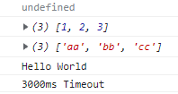

# A tiny example of emscripten, embind, bazel

## Build

`$ ./make`

## Run

Place `index.html`, `bazel-bin/hello/hello-wasm/hello.js`, `bazel-bin/hello/hello-wasm/hello.wasm` in a same directory.
You can see the output in DevTools.

